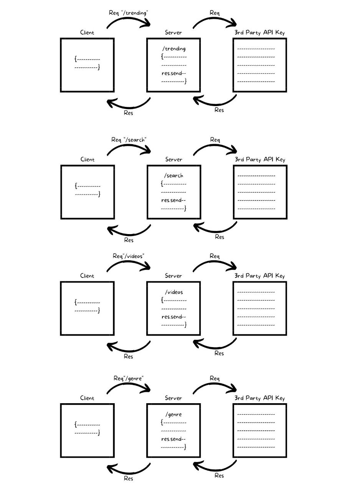

# Movies-Library - "1.0.0"
**Author Name**: Esraa Obeido

## WRRC 

## overview:
#### For today's lab, we continued to work in the Film Library Repository. We sent receive requests to a third party API and displayed the data.

## Getting Started:
#### In the first step, the server and the database were built for this project.
#### after that we created GET request to the 3rd party API for special endpoints.

## Project Features:
- Favorite Movie Page.
- Trending Movie Page to get the trending movies data from the Movie DB API Link.
- Search for a movie name to get its information.
- Videos route is used to handle requests to fetch videos related to a movie, for example if the client hit this route /videos?id=123, the server will retrieve the videos related to the movie with ID 123 and send them back as a response.
- Genre route is to allow the user to filter movies by their genres. 

