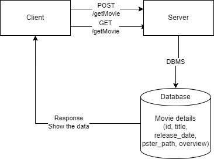

# Movies-Library - "1.0.0"
**Author Name**: Esraa Obeido

## WRRC 

## overview:
#### For today's lab, we set up our database and read and save the data in it.

## Getting Started:
#### In the first step, we created a database and created a table.
#### after that we inserted information into this table and displayed it when we hit the route i just created.

## Project Features:
- Favorite Movie Page.
- Trending Movie Page to get the trending movies data from the Movie DB API Link.
- Search for a movie name to get its information.
- Videos route is used to handle requests to fetch videos related to a movie, for example if the client hit this route /videos?id=123, the server will retrieve the videos related to the movie with ID 123 and send them back as a response.
- Genre route is to allow the user to filter movies by their genres. 
- Get movies: Create a get request to get all the data from the database.
- Add Movie : create a post request to save a specific movie to database along with your personal comments.

